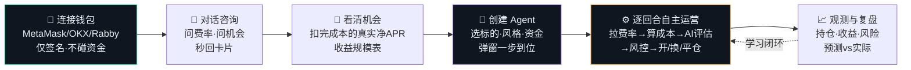
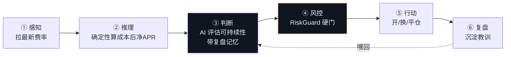

<div align="center">

# 🛩️ CarryPilot

### AI 资金费率套利 Agent 平台 · AI Funding-Rate Arbitrage Agent Platform

**不预测涨跌，让 Agent 帮你收资金费率**
*Don't predict the market — let agents harvest funding.*

[](#)
[](#)
[](https://hyperliquid.xyz)
[](https://injective.com)

**产品文档 (中文)** · [English Product Doc](#-english) · [📗 详细产品文档 / Product Doc](./docs/PRODUCT.md) · [🔧 技术文档 / Technical Doc](./docs/TECHNICAL.md)

</div>

---

## 📖 一分钟看懂

> 永续合约要贴住现货价，靠多空双方每小时互付「资金费」。费率为正时，做多的人付钱给做空的人。
> **CarryPilot 同时买现货 + 做空等额永续**：币价涨跌两边抵消（市场中性），专门白收这笔小时费。
> AI Agent 负责找机会、算成本、开单、盯盘、见坏就撤 —— 你只需连钱包、创建 Agent。

```
      买 $10,000 现货  ──┐                        ┌──  做空 $10,000 永续
       (涨→赚)          │     价格风险 ≈ 0        │      (涨→亏)
                        └────  涨跌互相抵消  ──────┘
                                    │
                            💰 每小时净收资金费
                                    │
                      ⚠ 扣掉：手续费 + 滑点 + 费率翻转风险
                         扣完还是正的，才叫机会 —— 引擎替你算
```

---

## 🗺️ 用户动线 · User Journey



---

## 🎯 六大功能中心

| 中心 | 你能做什么 |
|---|---|
| 💬 **对话助手** | 用大白话问「BTC 能套利吗」「现在有什么机会」，秒回带卡片答案；直接说「帮我做 1000u BTC」即可确认下单 |
| 📡 **费率现状** | Hyperliquid 全市场实时资金费率、年化、7 天曲线；标签一眼看懂（多付费/空付费/费率偏高/波动大）；一键跳 HL |
| 🔬 **套利机会** | 确定性引擎扣完全部成本后的**真实净 APR**，机会置顶高亮；点开看对冲结构、成本瀑布图、投入 1k~20k 的每日/每周收益规模、术语问号即点即懂；可直接「创建 Agent 跑这个」 |
| 🤖 **Agent 中心** | 一个「+ 创建新 Agent」按钮，弹窗里选标的/风格/资金/回合/AI 偏好；多 Agent 并行；每个 Agent 显示决策日志、预测 vs 实际图、复盘记忆；顶部是 INJ 积分（Agent 燃料）与充值 |
| 📈 **收益中心** | 当前持仓明细、PnL 曲线、平仓记录与防篡改 Receipt 哈希 |
| 🛡️ **风险中心** | 逐仓风险分级、费率衰减告警、未来 48h 三情景 PnL 预测图 |

---

## 🤖 核心：一支会自主运营的 Agent 舰队

每个 Agent 是独立、有记忆、会学习的自治单元，**每 10 分钟一个回合**自主循环：



- 🎭 **多风格人格**：保守 / 均衡 / 激进，决定入场门槛与仓位比例；可用结构化模板给 AI 注入偏好
- 📚 **记忆与学习**：每笔平仓自动复盘、沉淀教训，喂给下一次决策 —— 越跑越懂市场
- 🔄 **动态调仓**：发现更优标的且优势能盖过换仓磨损才换仓
- 🛡️ **AI 不越权**：AI 只出建议，仓位/限额/止损由确定性 RiskGuard 强制

---

## 🥷 Injective：身份 · 燃料 · 信任层

```mermaid
flowchart LR
    U["用户钱包<br/>Keplr/Leap/OKX"] -->|① 一键转 INJ| T["平台金库<br/>on Injective"]
    T -->|② 链上入账| C["积分<br/>1 INJ = N 积分"]
    C -->|③ 燃料| AG["🤖 Agent<br/>每回合消耗"]
    AG -->|④ 运营| PnL["套利收益"]
    style T fill:#10161f,stroke:#a78bfa
    style C fill:#10161f,stroke:#2ee6a8
```



- ⛽ **积分即燃料**：Agent 每回合消耗 INJ 积分 → 把「AI 运营」与链上资产直接挂钩，形成可持续经济飞轮
- 💳 **一键充值**：Cosmos 钱包（Keplr/Leap/OKX）签名转 INJ，链上到账自动入积分，充值记录可在区块浏览器验证
- 🪪 **链上身份 / 📜 不可篡改回执**：Agent 身份与平仓摘要哈希锚定 Injective（可验证证据链）

---

## 🚀 快速开始

```bash
git clone https://github.com/OneHaydenZhang/CarryPilot.git && cd CarryPilot
bash scripts/setup.sh                 # 装依赖
cp .env.example .env                  # 填 LLM key（可选）、INJ 金库地址（可选）
npm run web                           # 启动 → http://localhost:8080
```

> ⚠️ `.env` 与任何密钥永不入库；产品需求文档不入库。

---

<div align="center">

## 🌐 English

</div>

**CarryPilot** is an AI funding-rate arbitrage agent platform on Hyperliquid. It runs market-neutral carry — **long spot + short an equal perp** — so price moves cancel out and you collect the hourly funding longs pay shorts. A fleet of AI agents finds opportunities, computes true costs, opens positions, monitors, and exits — you just connect a wallet and create an agent.

**Six centers**: 💬 Chat assistant (ask rates/opportunities, confirm to trade), 📡 Rates, 🔬 Opportunities (net APR after full costs + plain payout tables + one-click "create agent"), 🤖 Agent Center (multi-agent, decision logs, predicted-vs-actual, review memory, INJ credits top-up), 📈 Earnings (open positions, PnL, receipts), 🛡️ Risk (per-position levels + 48h scenario projections).

**Agentic core**: every agent is autonomous, remembers, and learns — one round per 10 min: perceive rates → deterministic cost engine → AI judgment (with review memory) → RiskGuard → act → review. **AI only advises; positions/limits/stops are enforced by deterministic code.**

**Injective**: identity, fuel & trust layer. Agents burn INJ credits per round (top up in one click via Keplr/Leap/OKX; on-chain deposits verifiable in the explorer). Agent identity and closed-position receipt hashes are anchored on Injective.

See the **[🔧 Technical Doc](./docs/TECHNICAL.md)** for architecture and implementation, and the **[📗 Product Doc](./docs/PRODUCT.md)** for a full panel-by-panel walkthrough.

### 🔗 链上证据 · On-chain Evidence

| 项目 | 地址 / 合约 | 浏览器 |
|---|---|---|
| INJ 积分金库（Cosmos MsgSend 主网收款） | `inj18j9etc23pka9rhzy36qlchqrpttqm38mku0huu` | [injscan ↗](https://injscan.com/account/inj18j9etc23pka9rhzy36qlchqrpttqm38mku0huu/) |
| x402 testnet USDC（EIP-3009） | `0x0C382e685bbeeFE5d3d9C29e29E341fEE8E84C5d` | [Blockscout ↗](https://testnet.blockscout.injective.network/address/0x0C382e685bbeeFE5d3d9C29e29E341fEE8E84C5d) |
| x402 付款方 Payer（20 USDC 已核验） | `0x55Fb674168849c023d067953D6cA23FAFDBf93Ac` | [Blockscout ↗](https://testnet.blockscout.injective.network/address/0x55Fb674168849c023d067953D6cA23FAFDBf93Ac) |
| x402 收款金库 / Facilitator | `0xF3526895E582cA5Fe563554Fc5c156f243bA86cE` | [Blockscout ↗](https://testnet.blockscout.injective.network/address/0xF3526895E582cA5Fe563554Fc5c156f243bA86cE) |

> INJ 充值：用户 Cosmos 钱包 `signDirect` 签名原生 INJ `MsgSend` → 后端广播 → 按 txhash 幂等入积分；每笔在「Agent 中心 → 积分流水」附 injscan 交易链接。x402 详细调试记录见[技术文档开头](./docs/TECHNICAL.md#-链上证据--on-chain-evidencex402--inj-结算)。

---

<div align="center">

⚠️ *研究与模拟用途，不构成投资建议或收益承诺。示例数字为机制说明的假设，实际费率随市场波动。*
*For research/simulation. Not investment advice.*

**🛩️ CarryPilot** · Hyperliquid × Injective · AdventureX 2026

</div>
