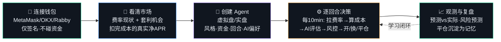

<div align="center">

# 🛩️ CarryPilot

### AI 资金费率套利 Agent · AI Funding-Rate Arbitrage Agent

**不预测涨跌，让 Agent 帮你收资金费率**
*Don't predict the market — let agents harvest funding.*

[](#)
[](https://hyperliquid.xyz)
[](https://injective.com)
[](#)

**中文** · [English](#-english)

</div>

---

## 📖 一分钟看懂

> 永续合约要贴住现货价，靠的是多空双方每小时互付「资金费」。费率为正时，做多的人付钱给做空的人。
> **CarryPilot 同时买现货 + 做空等额永续**：币价涨跌两边抵消（市场中性），专门白收这笔小时费。
> AI Agent 负责找机会、算成本、开单、盯盘、见坏就撤 —— 你只需连钱包、创建 Agent。

```
        买入 $10,000 现货  ──┐                          ┌──  做空 $10,000 永续
         (币价涨→赚)         │      价格风险 ≈ 0        │      (币价涨→亏)
                            └────  涨跌互相抵消  ───────┘
                                        │
                                💰 每小时净收资金费（多头付给空头）
                                        │
                          ⚠ 扣掉：手续费 + 滑点 + 费率翻转风险
                             扣完还是正的，才叫机会 —— 引擎替你算
```

---

## 🗺️ 用户动线 · User Journey



---

## 🏗️ 系统架构 · Architecture

```mermaid
flowchart TD
    subgraph L1[数据层 Data]
        HL[🌊 Hyperliquid API<br/>费率/盘口/现货 · 10min]
    end
    subgraph L2[智能层 Intelligence]
        ENG[⚙️ 确定性引擎<br/>成本瀑布·净APR·拒绝码]
        LLM[🐋 AI 评估<br/>可持续性判断·带复盘记忆<br/>只建议·不改数值]
        RISK[🛡️ RiskGuard<br/>仓位/资金硬顶·LLM不可越权]
    end
    subgraph L3[执行层 Execution]
        VIRT[🧪 虚拟盘<br/>零风险记账]
        LIVE[⚡ 实盘<br/>双腿下单·失败回滚]
    end
    subgraph L4[Injective]
        PTS[🥷 INJ 积分<br/>Agent 燃料·链上充值]
        RCP[📜 Receipt<br/>防篡改哈希]
    end
    HL --> ENG --> LLM --> RISK --> VIRT & LIVE
    VIRT & LIVE --> RCP
    PTS -.燃料.-> ENG
    VIRT & LIVE -.观测回流.-> OBS[📊 五大中心<br/>费率·机会·Agent·收益·风险]
    style L1 fill:#0a0e14,stroke:#4d9fff
    style L2 fill:#0a0e14,stroke:#2ee6a8
    style L3 fill:#0a0e14,stroke:#ffb454
    style L4 fill:#0a0e14,stroke:#a78bfa
```



**核心设计原则**：AI 只负责判断与解释，所有数值与下单由确定性代码完成。LLM 输出永远只是「建议」，仓位/限额/止损由 RiskGuard 强制执行。

---

## 🤖 AI Agent 能力 · Agentic Core

CarryPilot 的核心不是一个查询工具，而是一支**可自主运营的套利 Agent 舰队**。每个 Agent 是一个独立的、有记忆、会学习的自治单元：

```mermaid
flowchart LR
    subgraph AGENT[单个 Agent 的一个回合 · every 10 min]
        direction TB
        P[① 感知<br/>拉取全市场最新费率] --> R[② 推理<br/>确定性引擎算成本后净APR]
        R --> J[③ 判断<br/>AI 评估可持续性<br/>带自身复盘记忆]
        J --> G[④ 风控<br/>RiskGuard 硬门]
        G --> A[⑤ 行动<br/>开仓/换仓/清仓/观望]
        A --> M[⑥ 记忆<br/>平仓复盘沉淀教训]
        M -.喂回.-> J
    end
    style AGENT fill:#0a0e14,stroke:#a78bfa
```



| 能力 | 说明 |
|---|---|
| 🧠 **感知-推理-行动闭环** | 每回合自主完成：感知费率 → 确定性算成本 → AI 判断 → 风控 → 执行，无需人工干预 |
| 🎭 **多风格人格** | 保守 / 均衡 / 激进三种人格，决定入场门槛、仓位比例与退出线；可用**结构化模板**给 AI 注入偏好（标的白名单、回避条件、最低置信度） |
| 📚 **记忆与复盘** | 每笔平仓自动生成复盘教训，作为上下文喂给后续决策 —— Agent **越跑越懂这个市场** |
| 🔄 **动态调仓** | 费率变化时实时重估，发现更优标的且优势能盖过换仓磨损（2× 安全边际）才换仓 |
| 🛰️ **多 Agent 并行** | 一个用户可同时运营多个 Agent（不同标的/风格/盘口），Agent 中心统一观测 |
| 🛡️ **AI 不越权** | AI 只出「建议」，仓位/限额/止损由确定性 RiskGuard 强制；AI 失效自动降级为纯规则模式 |

---

## 🥷 Injective 结合与经济模型 · Economics

Injective 不是装饰性的「上链」叙事，而是 CarryPilot 的**身份、燃料与信任层**：

```mermaid
flowchart TD
    U[用户钱包] -->|① 转原生 INJ| T[平台金库<br/>on Injective]
    T -->|② 链上扫描·txhash 幂等| C[积分入账<br/>1 INJ = N 积分]
    C -->|③ 燃料| AG[🤖 Agent 每回合消耗]
    AG -->|④ 决策与执行| PnL[套利收益]
    AG -->|⑤ 平仓摘要| RC[📜 Receipt 哈希<br/>锚定 Injective]
    style T fill:#0a0e14,stroke:#a78bfa
    style C fill:#0a0e14,stroke:#2ee6a8
    style RC fill:#0a0e14,stroke:#4d9fff
```



- **⛽ 积分即燃料（Fuel）**：Agent 每个决策回合消耗 INJ 积分 → 把「AI 算力/运营」与链上资产直接挂钩，形成**可持续的经济飞轮**：用得越多、烧得越多、对 INJ 的真实需求越大
- **🪪 链上身份**：Agent 身份经 Injective 注册（ERC-8004 路线），可被第三方验证「这是一个真实、可调用的 Agent」
- **📜 不可篡改回执**：每笔平仓的结论摘要哈希上链，证明本地记录未被事后修改（诚信凭证，非外部成交证明）
- **🔗 归属精确**：EVM 登录地址 → bech32 推导对应 Injective 原生地址，用户从自己钱包转账即精确归属，无需中心化映射
- **🌐 数据可扩展**：Injective 自身的链上永续市场可作为未来跨所腿接入引擎（当前聚焦 HL 单所）

---

## 📦 版本说明 · Versions

### 🎯 产品版本 · Product

| 中心 | 能力 |
|---|---|
| 📡 **费率现状** | 全市场实时资金费率、年化、7 天坐标曲线；**标签筛选**（有机会/多付费/空付费/费率偏高/波动大/包装现货/仅观察）；点开看现状阐述；一键跳转 HL |
| 🔬 **套利机会** | 确定性引擎扣完成本的真实净 APR、机会**卡片置顶高亮**、过滤标签、对冲结构、**成本瀑布 SVG 图**、大白话收益表（投入 1k~20k 每 8h/天/周）、组合可行性说明、术语问号即点即懂 |
| 🤖 **Agent 中心** | **虚拟盘/实盘 workspace 切换**、燃料余量置顶、全局统计（胜率/回合/PnL）、**点击 Agent 进详情抽屉**（完整配置/全部仓位/复盘记忆/决策日志/预测对比）、决策日志、预测 vs 实际对比图 |
| 📈 **收益中心** | 按盘口隔离的 PnL 曲线、平仓记录、防篡改 Receipt 哈希 |
| 🛡️ **风险中心** | 逐仓风险分级、费率衰减告警、48h 三情景 PnL 预测图、实盘清算价观测 |
| ⚙️ **设置** | 钱包信息、**虚拟盘资金自设**、INJ 积分充值、实盘交易授权 |

> UI：动效首页（流动极光 / 漂浮光点 / 标题渐变 / 滚动揭示 / 实时扫描数）、明暗主题、中英双语、移动端适配、多钱包发现（EIP-6963）+ 移动深链、深链 tab（`/app#rates|opps|agents|earn|risk|settings`）。

### 💼 业务版本 · Business

- **市场中性套利**：HL 站内「现货多 + 永续空」，对冲价格风险，收资金费
- **虚拟盘 / 实盘双轨**：虚拟盘零风险体验（设置里自设资金），实盘经无提币权限的 API Wallet 真实下单；**Agent / 收益 / 风险 / 账户体系按盘口完全隔离**
- **Agent 自主运营**：每 10 分钟一回合（新建/启动即触发首个即时决策），AI 评估 + 确定性风控，自动开仓 / 换仓（含磨损核算，多收费率需盖过换仓成本 2 倍）/ 清仓，回合制生命周期（内测上限 120 回合 ≈ 20 小时）
- **积分燃料经济**：INJ 充值 → 积分 → Agent 每回合消耗，链上 txhash 幂等入账
- **学习闭环**：每笔平仓自动复盘沉淀为记忆，喂给后续 AI 决策

### 🔧 技术版本 · Technical

```
Node.js 22 + TypeScript (strict)  ·  零重框架、单进程 orchestrator
├─ src/connectors/   HL Info/Exchange API · Injective LCD · HL 实盘 SDK
├─ src/core/         candidates(引擎) · agents(回合决策) · risk · llm · points · store
├─ src/web/          零依赖 HTTP server + 单文件前端（明暗主题/中英文/移动端）
└─ scripts/          acceptance.ts 端到端验收（22 用例）
```

- **LLM**：经统一网关（对外仅显示模型家族名，如 DeepSeek），内置风控 system prompt（不得建议加杠杆/改数值/风控优先）+ 结构化偏好模板 + 复盘记忆上下文
- **钱包**：EIP-6963 多钱包可视化选择 + 移动端深链跳转（钱包 App 内置浏览器打开）；EIP-712 签名登录 + ApproveAgent 授权（HMAC session）
- **部署**：云 VM + systemd，公网 mainnet；一键 `git pull && systemctl restart`；配套端到端验收（22 用例）

---

## 🚀 快速开始 · Quickstart

```bash
git clone https://github.com/OneHaydenZhang/CarryPilot.git && cd CarryPilot
bash scripts/setup.sh                 # 装依赖 + 构建 Injective MCP
cp .env.example .env                  # 填 LLM key（可选）、INJ 金库地址（可选）等
npm run web                           # 启动，默认 http://localhost:8080
BASE_URL=http://localhost:8080 npx tsx scripts/acceptance.ts   # 22 项端到端验收
```

> `.env` 与任何密钥永不入库；私钥/授权钱包仅存服务端（0600）。

**在线体验**：已部署于 mainnet（Demo 地址见提交物 / 联系团队获取），连接钱包即可创建虚拟盘 Agent。

---

## 🧠 套利为什么存在？

| | |
|---|---|
| ⚓ **永续需要锚** | 永续无交割日，靠资金费率把合约价拉回现货价，费用每小时结算 |
| 🐂 **多头天然拥挤** | 牛市人人加杠杆做多 → 费率长期为正 → 空头持续收钱 |
| 🛡️ **对冲近乎无风险** | 现货多+永续空让涨跌抵消，只剩费率收入，剩余成本可被引擎精确计算 |

**这不是漏洞，是机制性的钱** —— 会持续流向愿意站在少数派（空头）一边平衡市场的人。

---

<div align="center">

## 🌐 English

</div>

**CarryPilot** is an AI funding-rate arbitrage agent on Hyperliquid. It runs market-neutral carry: **long spot + short an equal perp**, so price moves cancel out and you collect the hourly funding that longs pay shorts. AI agents find opportunities, compute true costs, open positions, monitor, and exit — you just connect a wallet and create an agent.

**Why arbitrage exists**: perpetuals need an anchor (funding pulls contract price to spot), longs are structurally crowded (funding stays positive → shorts get paid), and hedging makes it near risk-free (spot+perp cancel directional risk, leaving only fees/slippage the engine computes precisely).

**Five centers + settings**: Rates (live funding + 7-day charts + tags), Opportunities (net APR after full costs, cost-waterfall, plain payout tables), Agent (virtual/live workspaces, decision logs, predicted-vs-actual charts, review memory), Earnings (PnL curve + receipt hashes), Risk (per-position levels + 48h scenario projections), Settings (virtual balance, INJ credit top-up, live trading authorization).

**Key principle**: AI only judges and explains; all numbers and orders come from deterministic code. LLM output is always *advice* — position/limit/stop are enforced by RiskGuard.

**Tech**: Node 22 + TypeScript, zero heavy frameworks, single-process orchestrator. LLM via OpenRouter (model family name only shown). Multi-wallet (EIP-6963) + mobile deep-links. Deployed on GCP mainnet.

Deployed on mainnet — demo link available with the submission / on request.

---

<div align="center">

⚠️ *研究与模拟用途，不构成投资建议或收益承诺。示例数字为机制说明的假设，实际费率随市场波动。实盘请仅使用可承受损失的资金。*
*For research/simulation. Not investment advice. Live trading uses only funds you can afford to lose.*

**🛩️ CarryPilot** · Hyperliquid × Injective · AdventureX 2026

</div>
