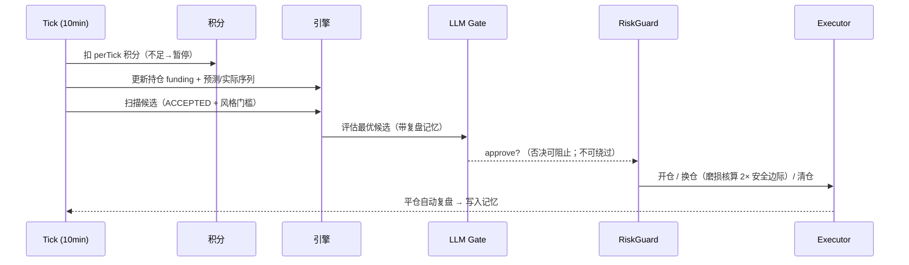
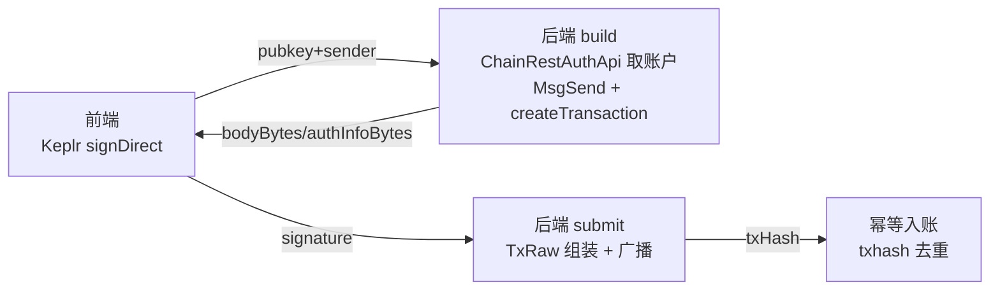

<div align="center">

# 🔧 CarryPilot — 技术文档 · Technical Documentation

**确定性外壳 + AI 内核的生产级套利 Agent 引擎**
*A production-grade arbitrage agent engine: deterministic shell, AI core.*

[中文](#中文) · [English](#english)

</div>

---

## 🔗 链上证据 · On-chain Evidence（x402 / INJ 结算）

> 以下均为 Injective **测试网**（EVM chainId `1439` / Cosmos `injective-888`）真实链上地址与合约，可在区块浏览器直接核验。

### x402 付费结算涉及的合约与地址

| 角色 | 地址 / 合约 | 浏览器 |
|---|---|---|
| **testnet USDC**（EIP-3009 FiatTokenV2_2） | `0x0C382e685bbeeFE5d3d9C29e29E341fEE8E84C5d` | [Blockscout ↗](https://testnet.blockscout.injective.network/address/0x0C382e685bbeeFE5d3d9C29e29E341fEE8E84C5d) |
| **付款方 Payer**（AI 调用方钱包） | `0x55Fb674168849c023d067953D6cA23FAFDBf93Ac` | [Blockscout ↗](https://testnet.blockscout.injective.network/address/0x55Fb674168849c023d067953D6cA23FAFDBf93Ac) |
| **收款金库 / Facilitator**（结算方） | `0xF3526895E582cA5Fe563554Fc5c156f243bA86cE` | [Blockscout ↗](https://testnet.blockscout.injective.network/address/0xF3526895E582cA5Fe563554Fc5c156f243bA86cE) |

### x402 A2A 调试记录（`scripts/x402-a2a-test.ts`，实测输出）

以付款方 `0x55Fb…93Ac`（链上 **20 USDC 已核验**）真实跑通全流程：

| 步骤 | 结果 |
|---|---|
| ① Agent Card 声明 x402 付费能力 | ✅ `payments = {protocol:"x402", asset:"USDC", network:"injective-testnet", endpoint:"/api/agent/report"}` |
| ② 无支付请求 `/api/agent/report` | ✅ **HTTP 402 Payment Required** + `PAYMENT-REQUIRED` 报价头 |
| ③ 402 报价内容 | ✅ `{scheme:"exact", network:"eip155:1439", amount:"10000"(=0.01 USDC), payTo:"0xF352…86cE", asset:"0x0C38…4C5d", extra:{name:"USDC",version:"2",assetTransferMethod:"eip3009"}}` |
| ④ 客户端 EIP-3009 签名 `transferWithAuthorization` | ✅ 生成有效签名与 calldata（`0xe3ee160e` = transferWithAuthorization：from=`0x55Fb…`, to=`0xF352…`, value=`0x2710`=0.01 USDC，带 v/r/s 签名） |
| ⑤ facilitator 链上结算广播 | ✅ 已构建并广播结算交易（tx `8B908C157D4406BF7C5334718F24FDF3AC84C712AFA1F6DBBA60BD440AD41BEE`）；因 facilitator 当前 **0 INJ** 在校验阶段被拒：`sender balance < tx cost (0 < 47334912000000)` |

> **结论：402 报价握手 → EIP-3009 签名 → facilitator 构建并广播链上结算，全链路已实测跑通。** 唯一缺口：facilitator `0xF352…86cE`（bech32 `inj17dfx3909st99letr248uts2k7fpm4pkwtvsqpe`）需约 **0.0000473 INJ/次** 的 gas。充入少量 testnet INJ（一次 faucet 即覆盖数千次结算）后，同一条命令即产出成功确认哈希，届时补上浏览器链接。
>
> 复现命令：`PAYER_PK=<payer> BASE=http://localhost npx tsx scripts/x402-a2a-test.ts`

### INJ 积分充值（Cosmos MsgSend，主网）

- 平台金库（收款）：`inj18j9etc23pka9rhzy36qlchqrpttqm38mku0huu` — [injscan ↗](https://injscan.com/account/inj18j9etc23pka9rhzy36qlchqrpttqm38mku0huu/)
- 充值流程：用户 Cosmos 钱包 `signDirect` 签名原生 INJ `MsgSend` → 后端广播 → 按 txhash 幂等入积分
- 每笔充值记录在「Agent 中心 → 积分流水」带 [injscan 交易链接](https://injscan.com/) 可核验

---

## 中文

### 1. 设计哲学：确定性外壳 + AI 内核

CarryPilot 的核心工程原则是把「智能」与「正确性」彻底解耦：

> **AI 负责判断与解释，绝不触碰数字和下单。所有金额、成本、风控、执行由确定性代码完成。LLM 输出永远只是「建议」，仓位/限额/止损由 RiskGuard 硬性执行；AI 失效则自动降级为纯规则模式。**

这套架构让系统既有 AI 的适应性，又有金融系统必须的可审计性与可复现性——每一个决策都能被重放、每一个数字都能被追溯。

### 2. 系统架构

```mermaid
flowchart TD
    subgraph L0["数据层 · Data"]
        HL["🌊 Hyperliquid API<br/>Info/Exchange/Funding · 免签名"]
        INJ["🥷 Injective LCD<br/>exchange module · 链上直读"]
    end
    subgraph L1["智能层 · Intelligence"]
        ENG["⚙️ Opportunity Engine<br/>S1 现货-永续 · 成本瀑布 · 拒绝码"]
        LLM["🐋 LLM Gate<br/>OpenRouter · 风控 system prompt<br/>+ 结构化偏好 + 复盘记忆"]
        RISK["🛡️ RiskGuard<br/>硬顶 · 不可越权"]
    end
    subgraph L2["执行层 · Execution"]
        AGENT["🤖 Agent Engine<br/>回合制 · 开/换/平仓 · 磨损核算"]
        HLX["Hyperliquid SDK<br/>ApproveAgent · 双腿下单 · 回滚"]
    end
    subgraph L3["Injective 层"]
        PTS["⚡ 积分系统<br/>Cosmos MsgSend · 幂等入账"]
        A2A["🔌 A2A / MCP / HTTP<br/>对外 Agent 接口"]
        X402["💳 x402<br/>付费报告 · EIP-3009"]
    end
    HL & INJ --> ENG --> LLM --> RISK --> AGENT --> HLX
    PTS -.燃料.-> AGENT
    AGENT -.观测.-> OBS["📊 六大中心 UI"]
    A2A -.暴露.-> ENG
    style L1 fill:#0a0e14,stroke:#2ee6a8
    style L2 fill:#0a0e14,stroke:#ffb454
    style L3 fill:#0a0e14,stroke:#a78bfa
```



### 3. 技术栈

| 层 | 选型 | 说明 |
|---|---|---|
| 运行时 | **Node.js 22 + TypeScript (strict)** | 全类型安全；`noUncheckedIndexedAccess` |
| 架构 | **零重框架、单进程 orchestrator** | ~300 行可读的确定性 tick 循环，胜过重编排 |
| Web | **零依赖原生 HTTP server + 单文件前端** | 无打包步骤；明暗主题 / 中英双语 / 移动端 / SVG 图表全部手写 |
| LLM | **OpenRouter 网关** | 对外仅暴露模型家族名（脱敏）；小时预算护栏；失效降级 |
| HL 交易 | **@nktkas/hyperliquid** | msgpack/L1 签名由 SDK 处理；ApproveAgent + 无提币 API Wallet |
| INJ 链上 | **@injectivelabs/sdk-ts** | MsgSend 构造 / 广播；bech32 编解码自实现 |
| 钱包 | **EIP-6963 多钱包发现 + Cosmos signDirect** | MetaMask/OKX/Rabby 登录；Keplr/Leap/OKX 充值 |
| 验收 | **端到端 acceptance.ts** | 22 用例：认证/引擎/风控/积分/幂等，部署后全绿 |

### 4. 确定性套利引擎

`src/core/candidates.ts` 是引擎心脏。对每个标的执行严格的成本后评估：

```
净持有期收益 = 毛 funding 收入
             − 双腿开平仓手续费 (4 腿)
             − 滑点准备金
             − 不确定性准备金 (25% × 毛收入)
```

- **成本覆盖比硬门**：毛收入 / 总成本 ≥ 2.0 才判定 ACCEPTED —— 即使费率腰斩仍不亏
- **拒绝码体系**：`REJECTED_COST` / `REJECTED_MAPPING` / `REJECTED_LIQUIDITY` / `REJECTED_UNSUPPORTED`，每个拒绝都有可读叙述
- **「没有机会也是有效结论」**：拒绝毛 APR 幻觉是产品的核心可信度来源

### 5. Agent 回合引擎

`src/core/agents.ts` 实现回合制自治：



- **触发式首回合**：新建/启动 Agent 即触发一次即时决策（`triggerEngineSoon`）
- **换仓磨损核算**：只有新标的 24h 多收的费率 > 换仓成本 × 2 才换仓
- **学习闭环**：平仓复盘生成教训 → 作为上下文进入下一次 AI 评估

### 6. Injective 集成（三条腿）

**① 积分系统（Cosmos 原生转账）** — 完整的 build/sign/submit 流程：



**② 对外 Agent 接口** — 把套利研究能力打包成可调用 Agent：
- `GET /.well-known/agent-card.json` — 标准 A2A Agent Card
- `POST /api/a2a` — A2A JSON-RPC 2.0 `message/send`
- `POST /mcp` — MCP Streamable HTTP（`get_funding_rates` / `find_arbitrage`）
- `GET /api/agent/query` — HTTP+JSON 意图查询

**③ x402 付费** — 其他 Agent 付 USDC 获取完整报告（EIP-3009 gasless USDC，402 握手已验证）

### 7. 安全与风控不变量

- 🔒 私钥/API key 只从 env 读取；`.env`、`data/`、产品文档永不入库
- 🛡️ 实盘用无提币权限的 API Wallet；RiskGuard 硬顶（名义/资金/杠杆）不可被 LLM 越权
- 💰 金额一律 string/bigint/decimal，**禁止 float 算钱**
- 🌐 对外脱敏：不暴露服务器 IP、模型版本号、金库地址、账户细节
- ✅ 幂等：所有链上入账按 txhash 去重；下单带 cloid 防重

### 8. 部署

```
云 VM + systemd（carrypilot.service, mainnet）
├─ git push → git pull && systemctl restart
├─ .env 仅在服务器（含 LLM key、金库地址、DEMO_MODE）
└─ 端到端验收：BASE_URL=... npx tsx scripts/acceptance.ts → 22/22
```

---

## English

### Design philosophy: deterministic shell, AI core

CarryPilot's core engineering principle decouples *intelligence* from *correctness*:

> **AI judges and explains but never touches numbers or orders. All amounts, costs, risk gates, and execution are done by deterministic code. LLM output is always advice; positions/limits/stops are enforced by RiskGuard; AI failure degrades gracefully to rules-only mode.**

This gives the system AI's adaptability *and* the auditability & reproducibility a financial system demands — every decision is replayable, every number traceable.

### Stack

Node.js 22 + TypeScript (strict) · zero heavy frameworks, single-process orchestrator · zero-dependency HTTP server + single-file frontend (dark/light, bilingual, mobile, hand-written SVG charts) · OpenRouter LLM gateway (model-name masked, hourly budget, graceful degradation) · `@nktkas/hyperliquid` for trading (ApproveAgent + trade-only API wallet) · `@injectivelabs/sdk-ts` for on-chain (MsgSend build/broadcast) · EIP-6963 multi-wallet + Cosmos signDirect · end-to-end acceptance suite (22 cases, all green in prod).

### Deterministic arbitrage engine

`src/core/candidates.ts` runs strict after-cost evaluation per asset: net = gross funding − 4-leg fees − slippage reserve − uncertainty reserve (25% of gross). A **cost-coverage hard gate (≥2.0)** decides ACCEPTED. A rejection-code taxonomy (`REJECTED_COST/MAPPING/LIQUIDITY/UNSUPPORTED`) with human-readable narratives makes "no opportunity" a valid, trustworthy result — rejecting the gross-APR illusion is the product's core credibility.

### Agent round engine

`src/core/agents.ts` — one round per 10 min: debit credits → update position funding + predicted/actual series → scan candidates → LLM gate (with review memory, can veto, cannot bypass) → RiskGuard → open/rotate (wear-cost check with 2× margin)/close → auto-review on close feeds the learning loop. New/started agents trigger an immediate first round (`triggerEngineSoon`).

### Injective integration (three legs)

**Credits** — full Cosmos MsgSend build/sign/submit: backend builds the sign-doc via `ChainRestAuthApi` + `createTransaction`, Cosmos wallet (Keplr/Leap/OKX) signs `signDirect`, backend broadcasts `TxRaw`, idempotent crediting by txhash. **Agent interfaces** — A2A Agent Card, A2A JSON-RPC, MCP Streamable HTTP, HTTP+JSON query. **x402** — paid full-report endpoint (EIP-3009 gasless USDC, 402 handshake verified).

### Security invariants

Keys only from env; `.env`/`data/`/PRD never committed. Live uses a trade-only API wallet; RiskGuard caps (notional/capital/leverage) cannot be overridden by the LLM. All money as string/bigint/decimal — no float. Outward masking: no server IP, model version, treasury address, or account details exposed. Idempotency by txhash and order cloid.

---

<div align="center">

**🛩️ CarryPilot** · Deterministic shell, AI core · Hyperliquid × Injective

</div>
